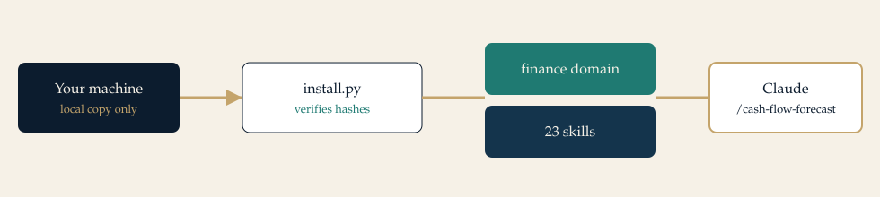

<p align="center">
  
</p>

# Practice Skills for Claude Code

**587 Claude Code skills for business work, in the Agent Skills `SKILL.md` format.** Written by Yasir Jilani. Install one domain in Claude Code, Codex, Cursor, Gemini CLI, Windsurf, or OpenCode. Each skill is a folder the agent loads only when the task matches.

Use it for finance, SEO, SaaS, supply chain, oil and gas, airlines, automotive, research, and the rest of a company. It is an independent library. It is not an Anthropic product, not a hosted service, and not legal, medical, tax, or investment advice.

<p align="center">
  
</p>

## Install Claude Code skills

Run this from the repository root. The installer checks `MANIFEST.sha256`, then copies skill folders on this machine. It does not download code, ask for a key, or run a skill.

Preview first:

```bash
python3 scripts/install.py --tool claude --domain finance --dry-run
```

Install when the plan looks right:

```bash
python3 scripts/install.py --tool claude --domain finance
```

That copies each finance skill to `~/.claude/skills/<skill-name>/SKILL.md`. Skills are not nested by domain in that folder. Repeat `--domain` to add another practice. Use `--domain all` only if you mean every skill.

| Tool | Command | Lands in |
| --- | --- | --- |
| Claude, all projects | `--tool claude` | `~/.claude/skills/` |
| Claude, one project | `--tool claude-project --project .` | `.claude/skills/` |
| Codex CLI | `--tool codex` | `~/.codex/skills/` |
| Gemini CLI | `--tool gemini` | `~/.gemini/skills/` |
| Generic Agent Skills | `--tool agents` | `~/.agents/skills/` |
| This project, generic | `--tool project --project .` | `.agents/skills/` |
| Cursor | `--tool cursor --project .` | `.cursor/skills/` |
| Windsurf | `--tool windsurf --project .` | `.windsurf/skills/` |
| OpenCode | `--tool opencode --project .` | `.opencode/skills/` |

Windows, macOS, and Linux use the same script. If `python3` is not on your PATH, use `py -3 scripts/install.py` with the same flags. `scripts/install.sh` only calls that script. There is no `curl | sh` path.

A domain id is the folder under `plugins/`, such as `finance` or `oil-gas`. Unknown ids stop the install. The list is `catalog/SKILLS.md`.

### Claude Code marketplace

This path installs a domain plugin. It does not use `scripts/install.py`.

From a local checkout:

```text
/plugin marketplace add /absolute/path/to/yj-claude-skills
/plugin install finance@yj-skills
```

After you publish the repository as `claude-practice-skills`:

```text
/plugin marketplace add YOUR_GITHUB_USER/claude-practice-skills
/plugin install finance@yj-skills
```

The marketplace name is `yj-skills`. Each domain is one plugin. Author metadata is Yasir Jilani.

## SKILL.md format

```text
plugins/finance/skills/cash-flow-forecast/
├── SKILL.md
├── references/assumptions.md
└── scripts/cashflow_check.py
```

`SKILL.md` is the procedure. The description tells Claude when to load it. The body stays under 500 lines. Longer notes live in `references/` and load only if needed. Scripts, where they exist, are Python standard library and do not open a network connection.

```markdown
---
name: cash-flow-forecast
description: "Build a 13-week direct cash forecast from collections and commitments, not from accrual revenue. Use when the user mentions 13-week cash, cash forecast, or when do we run out of money."
license: MIT
metadata:
  author: Yasir Jilani
  version: "1.0.0"
  domain: finance
---
```

Invoke it in Claude with `/cash-flow-forecast`, or ask in plain language. Claude can also load the skill when the description matches.

## Examples

Every skill has one file under `examples/by-skill/`. Each file is a scenario: what the skill is for, the sample data, and a filled outcome. The index is [examples/INDEX.md](examples/INDEX.md).

A cash scenario with a week-by-week result is in [examples/01-cash-forecast.md](examples/01-cash-forecast.md). A YouTube outline with the creator's own receipt and timing notes is in [examples/by-skill/creator/youtube-video-outline.md](examples/by-skill/creator/youtube-video-outline.md).

```bash
python3 plugins/finance/skills/cash-flow-forecast/scripts/cashflow_check.py examples/weeks.csv --opening 180000 --buffer 40000
```

## Domains

| Domain | Skills | Use it for |
| --- | ---: | --- |
| Engineering | 27 | Design docs, reviews, incidents, releases |
| Marketing | 24 | Positioning, campaigns, claims you can support |
| Finance | 23 | Cash, runway, margin, management packs |
| People | 23 | Hiring, reviews, bands, onboarding |
| Strategy | 22 | Choices, board memos, operating cadence |
| Sales | 20 | Discovery, qualification, proposals |
| Product | 20 | Briefs, PRDs, experiments, roadmaps |
| Legal operations | 18 | Contract triage and counsel briefs |
| Accounting | 17 | Close, reconciliations, audit prep |
| Security defense | 16 | Controls and response. No exploits |
| Operations | 16 | SOPs, capacity, service levels |
| Data | 23 | Contracts, lineage, freshness, readouts |
| Risk and compliance | 15 | Assessments, controls, issue logs |
| Delivery | 14 | Charters, status, RAID, change control |
| Customer | 14 | Journeys, recovery, health scores |
| Manufacturing | 14 | Quality, CAPA, schedule, traceability |
| Design | 13 | Critique, UX writing, handoff, access |
| Healthcare operations | 12 | Clinic flow and documentation quality |
| Education | 12 | Lessons, rubrics, workshops |
| Research | 17 | Questions, evidence, consent, claim limits |
| Supply chain | 17 | Demand, inventory, OTIF, dock exceptions |
| Entrepreneurship | 14 | Runway, first customers, idea screens |
| Media | 12 | Assignments, source logs, headlines |
| AI | 10 | Use cases, evals, review gates, cost |
| SEO | 8 | Query maps, intent, local listings |
| Oil and gas | 8 | Production, nominations, site notes |
| Airline | 8 | Delays, duty checks, station opens |
| Automotive | 8 | Service lane, recalls, handovers |
| Small business | 8 | Owner cash, first hire, local offers |
| SaaS | 8 | Weekly metrics, activation, pricing page |
| Blog | 8 | Assignments, edits, titles, sources |
| Energy | 8 | Tariffs, bills, curtailment |

The rest of the tree is in [catalog/SKILLS.md](catalog/SKILLS.md).

## Trust this tree

| Promise | How to check |
| --- | --- |
| No telemetry and no license server | Read `scripts/install.py`. It copies files. |
| No remote installer | There is no `curl` pipeline in the install docs. |
| Hashes match the files | `python3 scripts/validate.py` |
| Author is visible | Every skill says Yasir Jilani |
| Not an official Claude product | This README says so, on purpose |

Regulated skills tell the agent to draft for a qualified human. They do not invent statutes, diagnoses, coverage decisions, or valuations. Security skills are defensive. If a request asks for deception or evasion, the skill says to stop.

Details: [SECURITY.md](SECURITY.md).

## Repository map

```text
yj-claude-skills/
├── .claude-plugin/marketplace.json
├── plugins/<domain>/
│   ├── .claude-plugin/plugin.json
│   └── skills/<skill-name>/SKILL.md
├── examples/by-skill/<domain>/<skill-name>.md
├── catalog/SKILLS.md
├── scripts/install.py
└── source/
```

`plugins/` is what you install. `source/` is what you edit. `python3 scripts/generate.py` rebuilds `plugins/` from `source/`. You do not need the generator to install.

Naming, the `SKILL.md` format, and how two people add a skill are in [CONTRIBUTING.md](CONTRIBUTING.md).

## License

MIT. Copyright 2026 Yasir Jilani. See [LICENSE](LICENSE).
